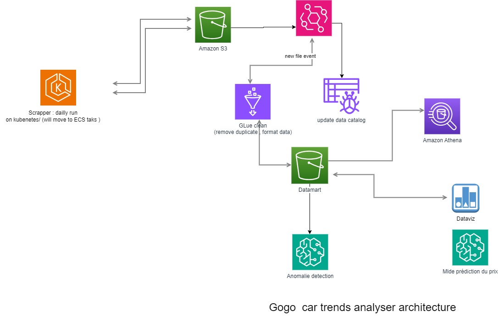

# gogoScraper

This a simple python scraper to get different jumia  deal information using scrapy

## Architecture 

## Build:

 docker build -t tsafacjo/jumia-car-scrap --platform linux/arm64 .
 
 docker tag tsafacjo/jumia-car-scrap  tsafacjo/jumia-car-scrap:0.2

 docker push tsafacjo/jumia-car-scrap:0.2   

 ##  Datamart

 This model will be primarily useful for analyzing the characteristics of the cars listed on the website, trends in car listings, and potential market demands. Here's the revised data model:

Revised Scope of the Datamart:
Objective: To analyze car listings, focusing on car features, pricing trends, and listing durations.
Key Metrics: Number of listings per car model, average listing price, listing duration, and geographical distribution of listings.
Target Users: Inventory managers, pricing analysts, and market researchers.
Data Model:
Fact Table:
Fact_CarListings
ListingID (Primary Key)
CarID (Foreign Key)
DateListedID (Foreign Key)
DateSoldID (Foreign Key, nullable if not sold yet)
SellerID (Foreign Key)
ListingPrice
ListingDurationDays (calculated as difference between DateListed and DateSold)
Dimensional Tables:
Dim_Car

CarID (Primary Key)
Make
Model
Year
Category (e.g., SUV, Sedan, Hatchback)
PriceRange
Dim_Date

DateID (Primary Key)
Date
DayOfWeek
Month
Quarter
Year
Dim_Seller

SellerID (Primary Key)
SellerType (e.g., Dealer, Private Seller)
Location
Explanation:
Fact_CarListings: This table is the core of the datamart, focusing on each individual car listing. It includes details about the listing price and duration.

Dim_Car: Contains detailed information about the cars, which can be used to analyze trends in makes, models, and categories that are popular or preferred in listings.

Dim_Date: Allows analysis of trends over time, such as seasonal variations in listings or how long cars typically stay listed before being sold.

Dim_Seller: Provides insights into who is listing the cars (dealers vs. private sellers) and their geographical distribution. This can help in understanding market dynamics and seller behaviors.

## Steps

To study and gain insights from the revised datamart model focusing on car listings, you can perform various analyses and generate reports based on the data captured in the fact and dimension tables. Here are some key approaches and analyses you can conduct:

### 1. Market Trend Analysis:
   - **Seasonal Trends**: Use the `Dim_Date` table to identify trends in car listings and sales across different times of the year. This can help in understanding seasonal demand.
   - **Year-over-Year Comparisons**: Compare data across years to identify long-term trends in car listings and sales.

### 2. Car Popularity Analysis:
   - **Make and Model Preferences**: Analyze the `Dim_Car` table to determine which makes and models are listed most frequently and which ones have the shortest listing duration.
   - **Category Analysis**: Look into different car categories (like SUVs, Sedans, etc.) to understand market preferences.

### 3. Pricing Strategy Analysis:
   - **Average Listing Price**: Calculate the average listing price for different car types, models, and years. This can provide insights into pricing strategies and market value.
   - **Price Fluctuations**: Study how prices vary over time and between locations, which could indicate regional market differences.

### 4. Seller Behavior Analysis:
   - **Seller Type Analysis**: Compare listing patterns between different seller types (dealers vs. private sellers) using the `Dim_Seller` table.
   - **Geographical Analysis**: Understand which regions have the most listings and whether certain types of cars are more popular in specific areas.

### 5. Listing Duration Analysis:
   - **Time on Market**: Calculate the average time cars stay listed before being sold. This can indicate the demand for certain types of cars.
   - **Unsold Inventory**: Identify models or categories that tend to remain unsold for longer periods.

### Data Visualization and Reporting:
   - Use data visualization tools to create dashboards and reports that make it easier to identify patterns and trends.
   - Graphical representations such as bar charts, line graphs, and heat maps can be particularly effective.

### Predictive Analysis:
   - If historical data is abundant and reliable, predictive models can be developed to forecast future trends in car listings and pricing.

### Continuous Improvement:
   - Regularly update and refine the datamart model based on new data and evolving business requirements.
   - Encourage feedback from end-users (analysts, managers) to improve the data model and the insights derived from it.

By conducting these analyses, you can gain valuable insights into market dynamics, customer preferences, and effective pricing strategies. This information is crucial for strategic decision-making, inventory management, and marketing efforts. Remember, the quality and granularity of your data will significantly impact the depth and accuracy of your analysis.